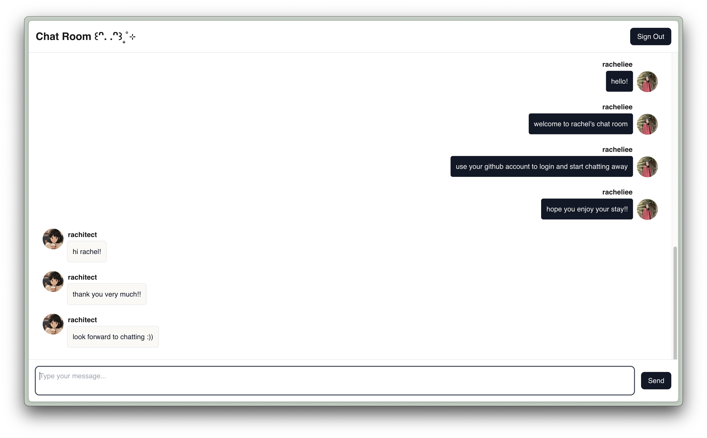

# Webchat App
Lablup 2025 Winter Internship Toy Project

## Description
A simple webchat app that allows users to chat with each other in real-time. Users must login with their github account to use the app.

## Project Structure
### Frontend
- Contains the frontend code for the webchat app

Setup:
```bash
cd frontend
npm install
```

Running the frontend:
```bash
cd frontend
npm run dev
```

### Backend
- Contains the backend code for the webchat app

Setup:
```bash
cd backend
pip install -r requirements.txt # use a virtual environment if you want
```

Running the backend:
```bash
cd backend
python app.py

# for dev mode
adev runserver app.py --host 0.0.0.0 --port 8080
```

## Deployment
This webchat is deployed through Amazon Web Services (AWS). It currently does not have a domain name, but you can access it through the [following link](http://15.164.93.98:3000/)

## Demo Images



